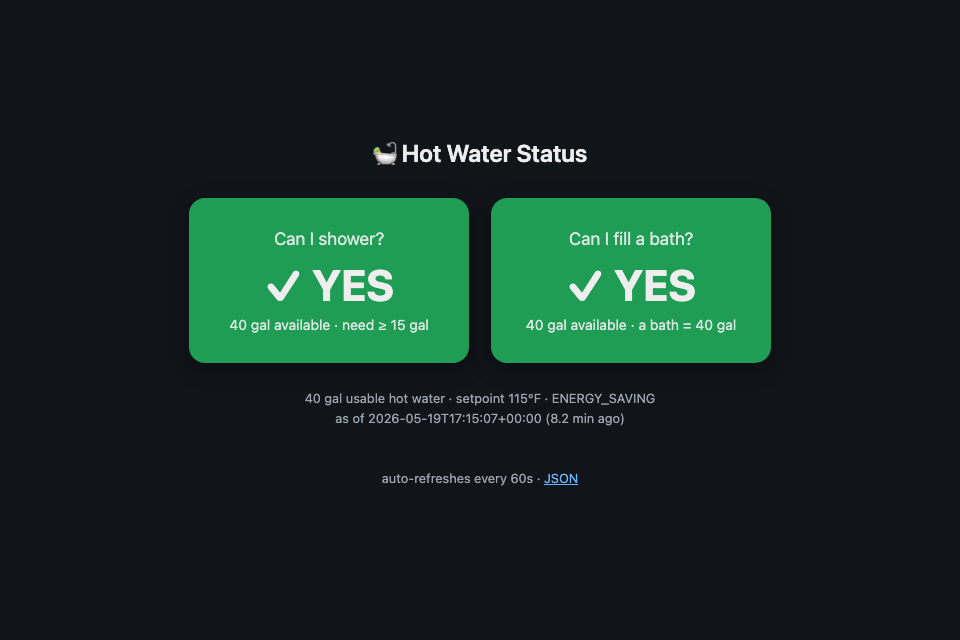
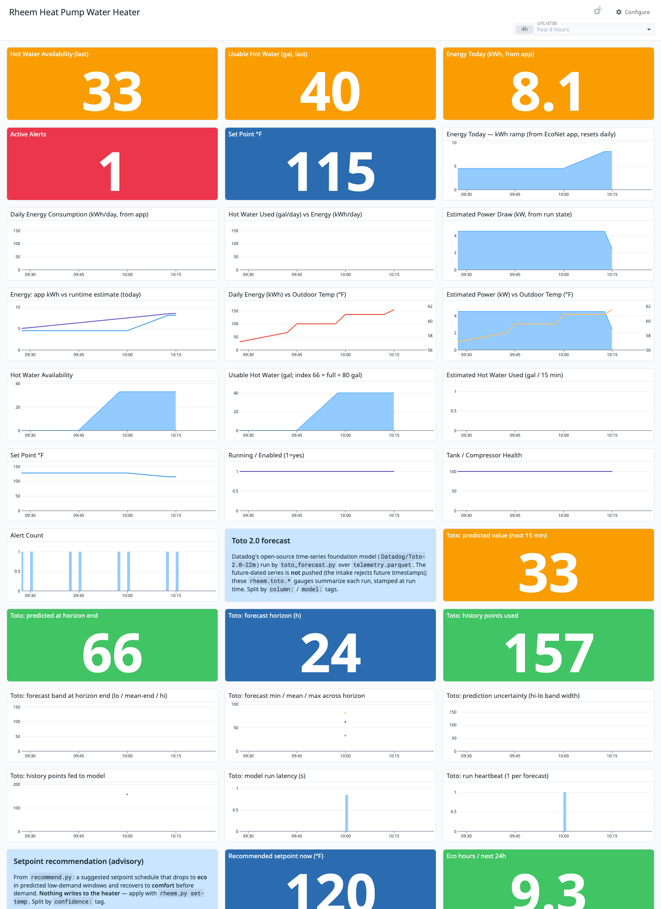

# econet-toto-project

An observe-only telemetry, forecasting, and energy-optimization pipeline for
a **Rheem EcoNet heat-pump water heater (HPWH)** — collect every 15 min →
store in Parquet → ship metrics to Datadog → forecast demand with Datadog's
**Toto** time-series foundation model → recommend energy-saving setpoint
changes. **Nothing in the scheduled path ever writes to the heater.**



## Why this project exists

A heat-pump water heater is one of the largest always-on loads in a home,
and most of its energy goes to **standby reheating** — keeping ~80 gallons
hot around the clock even during the many hours nobody draws hot water. The
heater is also a black box: Rheem's EcoNet units are **cloud-tethered** (no
local API — see below), so the only window into them is a phone app that
shows a coarse "hot water available" gauge and a daily kWh number, with no
history, no alerting, and no way to reason about *when* hot water is actually
needed.

This project turns that black box into an observable, forecastable system,
with a concrete goal: **spend less energy on standby heat without ever
running out of hot water.** Concretely it:

- **Makes the heater observable.** A 15-minute collector pulls telemetry
  (hot-water availability, setpoint, run state, real EcoNet kWh, tank and
  compressor health, alerts) into Parquet and Datadog, with a color-coded
  dashboard — so you can see behavior, trends, and problems over time
  instead of a single live number.
- **Forecasts demand.** Datadog's open-source **Toto 2.0** model predicts
  hot-water availability/demand 24 h ahead from the collected history.
- **Recommends savings.** `recommend.py` turns that forecast into an
  advisory setpoint schedule — drop to an eco temperature during predicted
  low-demand windows, recover before demand — and estimates the standby-loss
  saving. It is **strictly advisory**; you apply changes yourself.
- **Answers the everyday question.** A small `/hotwater` web page (shown
  above) answers "can I shower?" / "can I fill a bath?" at a glance, with a
  minutes-until-ready estimate when the answer is no.

It also doubles as a worked example of instrumenting an opaque cloud device
end-to-end: telemetry modeling, calibration of a vendor's fuzzy index into
real units, foundation-model forecasting, and turning predictions into an
actionable policy.

## Why it's cloud, not local

A port scan of the heater shows **no local services** — every TCP port is
filtered. Rheem EcoNet HPWHs are cloud-tethered: the unit keeps an *outbound*
MQTT connection to Rheem's ClearBlade broker and accepts no inbound LAN
connections. So there is no local API. The open-source path is
[`pyeconet`](https://github.com/w1ll1am23/pyeconet) (the library Home
Assistant's `econet` integration uses), authenticated with your EcoNet
mobile-app credentials.

## Architecture

```
launchd (every 15 min) → rheem.py log ─┬→ telemetry.parquet   (the store)
                                        └→ Datadog metrics      (rheem.*)
                                                  │
dashboard.py ──────────────────────────────────────┘  (Datadog dashboard)

toto_forecast.py ← reads telemetry.parquet ─┬→ forecast.parquet (prediction)
                                             └→ Datadog rheem.toto.* (summary)

recommend.py ← telemetry.parquet + forecast.parquet ─┬→ recommendation.parquet
   (advisory setpoint schedule; never writes heater)  └→ Datadog rheem.reco.*
```

Telemetry covers hot-water availability, setpoint, run state, tank/compressor
health, and alerts. Real energy use **is** available — `rheem.py` calls
EcoNet's usage-report endpoint, so `rheem.energy_today_kwh` carries the same
kWh the app shows (it is `None` only if that call is never made). Water-usage
reporting is not supported on this particular unit.

## Dashboard

The Datadog dashboard (color-coded big numbers, Toto forecast section, and an
advisory recommendation section):



Live (public, read-only):
<https://p.datadoghq.com/sb/ptw1l8uqp92273af-65cdb4b9fd0cc28a44f93d2ac060955d>

## Two Python environments (important)

Toto's deps (torch, gluonts, …) are heavy and version-touchy, so they live in
their own venv, separate from the lightweight collector/recommender:

- **`.venv`** — collector, Datadog, `recommend.py`. `make setup`
  (`pip install -r requirements.txt`). Python ≤3.12 recommended; on Python
  3.14 `scipy`/Toto have no wheels, which is the original reason for the split.
- **`.venv-toto`** — Toto only. `make setup-toto` creates it with `uv` when
  available (it handles uv-managed Python; plain `python3.12 -m venv` can't run
  ensurepip on those), else falls back to stdlib `venv`. Installs:
  ```
  pandas pyarrow torch
  toto-2 @ git+https://github.com/DataDog/toto.git#subdirectory=toto2
  ```

## Setup

Credentials live **outside the repo** in `~/.config/rheem/env` (override the
directory with `$XDG_CONFIG_HOME`). Values already exported in your shell take
precedence over the file.

```bash
mkdir -p ~/.config/rheem
cp env.example ~/.config/rheem/env   # fill ECONET_*; DD_* optional
chmod 600 ~/.config/rheem/env
```

## Use

A `Makefile` wraps the common flows (`make help` lists them):

```bash
make setup            # .venv (3.14): collector + Datadog deps
make setup-toto       # .venv-toto (3.12): Toto deps
make config           # scaffold ~/.config/rheem/env from env.example
make status           # one-shot telemetry dump
make log              # one collection -> parquet (+ Datadog)
make dashboard        # create dashboard  (make dashboard DASH_ID=<id> to update)
make forecast         # Toto forecast (make forecast COLUMN=set_point HORIZON=48)
make recommend        # advisory setpoint schedule (never writes the heater)
make install-agent    # load the 15-min launchd collector
```

### Goal: spend less energy on standby heat

The end goal of this project is to **lower the setpoint during predicted
low-demand windows** and recover before hot water is needed. `recommend.py`
is the advisory step toward that:

```bash
make recommend                                   # Balanced defaults
.venv/bin/python recommend.py --eco 100 --comfort 120 --horizon 24
```

It builds a hot-water **demand proxy** from `telemetry.parquet` (the positive
drops in the 0-100 availability index), blends in the Toto forecast from
`forecast.parquet` when it's fresh, and prints a suggested setpoint schedule
plus a rough standby-loss saving — **advisory only; it never writes to the
heater.** Apply a block yourself with `rheem.py set-temp <F>`. It degrades
honestly: with little history it says so and recommends staying at comfort.

### Gallons of hot water (calibrated)

`tank_hot_water_availability` is a **coarse quantized index** — this unit
only reports ~0/33/66/100, not a continuous fraction of stored gallons. In
ENERGY_SAVING mode **66 is its normal "full and ready" step** (what the
EcoNet app shows as full), so a naive `index/100 × 80` wrongly reads a full
tank as 52.8 gal. Instead we calibrate **index 66 → `RHEEM_USABLE_GALLONS`
(default 80 gal)**:

```
gallons = availability / RHEEM_FULL_INDEX(66) × RHEEM_USABLE_GALLONS(80)
```

So 33 → 40 gal, 66 → 80 gal (full), and 100 → ~121 gal (a real *boosted*
reserve, e.g. high-demand pre-heat — not an error). All three knobs are
env-overridable. The collector emits `rheem.tank_gallons_available`,
`rheem.py status` shows it, and the dashboard has usable-gallons and
estimated-gallons-drawn widgets. Still an estimate — the index is coarse —
but it now matches the heater/app.

### Energy (kWh) and weather

`rheem.py log` calls EcoNet's usage-report endpoint, so
`rheem.energy_today_kwh` / `energy_type` carry the **same kWh the app
shows** (these are `None` until that call is made — which is why earlier
docs said the unit reported no energy). An independent runtime estimate
(`rheem.power_est_kw`, `rheem.energy_est_kwh_today`; ~0.45 kW heat pump /
4.5 kW elements, override `RHEEM_HP_KW`/`RHEEM_ELEMENT_KW`) is shipped as a
cross-check — it tracked the real value within ~4% in practice. Outdoor
temperature (`rheem.outdoor_temp_f`, Open-Meteo, no API key — set
`RHEEM_LAT`/`RHEEM_LON`, default ZIP 97501) is overlaid on the right axis
of the energy/power graphs, since heat-pump COP falls as it gets colder.

### `/hotwater` status page

A tiny stdlib service (`hotwater-web/server.py`, in docker-compose, behind
nginx at `/hotwater`) reads `rheem.jsonl` and answers **"can I shower?"**
and **"can I fill a bath?"** (40 gal) with red/green widgets. When the
answer is NO it estimates minutes-to-ready from the recent recovery rate;
the page is responsive and auto-refreshes. JSON at `/hotwater/api`.

Equivalent direct invocations:

```bash
# ad-hoc
.venv/bin/python rheem.py status
.venv/bin/python rheem.py log            # one collection -> parquet (+ Datadog)

# Datadog dashboard (needs DD_API_KEY + DD_APP_KEY)
.venv/bin/python dashboard.py            # prints dashboard URL
.venv/bin/python dashboard.py <dash_id>  # update existing

# forecast (after some history accumulates)
.venv-toto/bin/python toto_forecast.py tank_hot_water_availability --horizon 96
```

### Scheduled pipeline (launchd)

`make install-agent` renders the path-agnostic templates in `launchd/*.plist.in`
(substituting this repo's path and venv interpreters) into
`~/Library/LaunchAgents/` and loads three jobs:

| job                  | cadence            | what it does |
|----------------------|--------------------|--------------|
| `com.rheem.telemetry`| every 15 min       | `rheem.py log` → `telemetry.parquet` + `rheem.*` |
| `com.rheem.forecast` | hourly, on the hour| `toto_forecast.py` → `forecast.parquet` + `rheem.toto.*` (no-op until ~8h of data) |
| `com.rheem.recommend`| hourly, at :10     | `recommend.py` → `recommendation.parquet` + `rheem.reco.*` |

All metrics go to Datadog from inside the scripts; per-job stdout/stderr land
in `logs/` (gitignored). `make uninstall-agent` unloads and removes all three.
Forecast runs hourly (not every 15 min) because Toto re-forecasts the full
24 h horizon each run — a finer cadence would just reload the model for no
new signal. Recommend runs at :10 so it consumes the fresh forecast.

## Logs → Datadog (via the Agent, not the HTTP API)

`rheem.py log` writes structured newline-delimited JSON to `rheem.jsonl`
(Datadog standard attrs: `status`, `service=rheem-water-heater`,
`source=rheem`). The local Datadog **Agent** ships it:

- `logs_enabled: true` set in `/opt/datadog-agent/etc/datadog.yaml`
  (backup saved alongside as `datadog.yaml.bak.*`)
- log integration: `/opt/datadog-agent/etc/conf.d/rheem.d/conf.yaml` tails
  `rheem.jsonl`

This path uses the Agent's own (valid) API key, so logs work even though the
standalone `DD_API_KEY`/`DD_APP_KEY` for `dashboard.py` don't exist yet. Verify
with `datadog-agent status | grep -A4 rheem`.

## Notes / honest caveats

- The full future-dated Toto series is written to `forecast.parquet` and
  printed — **not** pushed to Datadog, because the metrics intake rejects
  future-dated points. The parquet holds the full prediction.
- `toto_forecast.py` does push a per-run **summary** as `rheem.toto.*` gauges
  stamped at run time (predicted next/horizon-end value, band width, history
  points, run latency, heartbeat), tagged `column:` / `model:`. The dashboard
  has a dedicated Toto section for these. No-op if `DD_API_KEY` is unset.
- The collector logs to Parquet first, then attempts Datadog; a Datadog
  failure never loses a stored row.
- Credentials are read from `~/.config/rheem/env` at runtime and are never
  committed; the repo ships only `env.example`.
- The unit currently reports **1 active alert**; `pyeconet` only gives the
  count — check the EcoNet app for detail.

## License

Licensed under the [Apache License 2.0](LICENSE).
